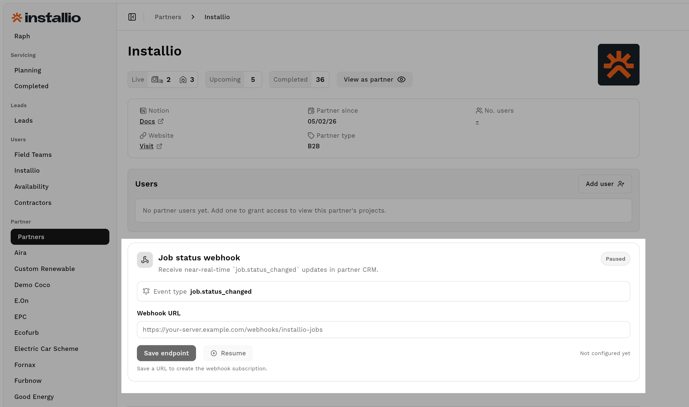

# Partner API Overview

**Audience:** External partner engineering teams integrating CRM and lead flows  
**Status:** Shareable externally  
**Version:** 1.0

This document is the standalone overview for the Installio/Breengy Partner API. It covers environments, authentication, endpoint selection, usage guidance, rate limiting, webhook events, and error handling.

---

## 1. Base URLs and environments

All endpoints are deployed as Google Cloud Functions in `europe-west2`.

- **Development (example):**  
  `https://europe-west2-co-pilot-dev-f762b.cloudfunctions.net`
- **Production (example):**  
  `https://europe-west2-co-pilot-b7f8e.cloudfunctions.net`
- **Local emulator (example):**  
  `http://127.0.0.1:5001/<project-id>/europe-west2`

Confirm exact URLs with your platform administrator before go-live.

---

## 2. Authentication

Every Partner API endpoint uses a partner API key in the `Authorization` header.

Recommended format:

```http
Authorization: Bearer <partner-api-key>
```

Also accepted:

```http
Authorization: ApiKey <partner-api-key>
Authorization: api-key <partner-api-key>
Authorization: <partner-api-key>
```

Behavior:

- Missing/invalid key -> `401`
- Disabled key -> `401`
- Valid key attributes each request to one `partnerId`

---

## 3. Endpoint catalog

| Endpoint                    | Method(s)         | Purpose                                                                              | Details                                                                                                    |
| --------------------------- | ----------------- | ------------------------------------------------------------------------------------ | ---------------------------------------------------------------------------------------------------------- |
| `/partnerLeadSubmit`        | `POST`            | Full lead flow: create lead, request estimate, submit to Spruce, downstream CRM sync | [partnerLeadSubmit.md](https://github.com/Installio/partner-API-docs/blob/main/Partner-Lead-Submit-API.md) |
| `onProjectJobStatusWebhook` | Firestore trigger | OMS -> Partner webhook                                                               | Sends `job.status_changed` updates to partner `webhookUrl`                                                 |
| `onLeadHubSpotPush`         | Firestore trigger | OMS -> HubSpot sync                                                                  | [HubSpot sync docs](https://github.com/Installio/partner-API-docs/blob/main/Hubspot-integration.md)        |
| `hubspotWebhook`            | HTTPS endpoint    | HubSpot -> OMS sync                                                                  | [HubSpot sync docs](https://github.com/Installio/partner-API-docs/blob/main/Hubspot-integration.md)        |

---

## 4. Usage guide

## 4.1 Job status webhook flow (`onProjectJobStatusWebhook`)

When a Firestore document in `projects/{projectId}` is written, OMS evaluates whether job status changed.

Trigger behavior:

- Reads status from any of: `status`, `job_status`, `jobStatus`, `project_status`, `projectStatus`.
- Sends webhook only when `oldStatus !== newStatus`.
- Skips delivery if `partner_id`/`partnerId` is missing on the project document.
- Derives `job_id` from `job_id`, `jobId`, `installio_job_id`, `installioJobId`, `id`, or falls back to `projectId`.

Delivery to partner `webhookUrl`:

- Method: `POST`
- Header: `Content-Type: application/json`
- User agent: `Installio-Partner-Webhook/1.0`
- Timeout: 8 seconds
- Success criteria: any `2xx` response from partner endpoint
- Non-`2xx` or timeout/network errors are logged as delivery failures

## 4.2 Lead submission endpoint

- Use `partnerLeadSubmit` when you need the full lead pipeline (Spruce job submission and downstream CRM processing).
- This endpoint requires partner API key auth.
- It supports direct or wrapped payload (`data`) formats.
- It applies the same partner rate limits.
- Full payload and response spec: [partnerLeadSubmit.md](https://gist.github.com/tigranelyazyan/6f13bb06ca76019280e01d5edb419c2b)

## 4.3 Web app: set partner `webhookUrl`

Your web app includes an input field where a partner can set the destination URL for job status webhooks.

Recommended guidance text for UI:

- Label: **Webhook URL**
- Help text: **Enter your public HTTPS endpoint to receive `job.status_changed` events.**
- Validation: **Must be a valid `https://` URL reachable from the public internet.**
- Example value: `https://partner.example.com/installio/webhooks/job-status`

Suggested partner-facing note:

> We send `POST` requests with JSON payload whenever OMS detects a job status change.  
> Your endpoint should return HTTP `2xx` quickly (within 8 seconds timeout window).



## 4.4 OMS <-> HubSpot sync

These flows are part of the integration architecture:

| Function            | Direction      | Trigger type      | Purpose                                       |
| ------------------- | -------------- | ----------------- | --------------------------------------------- |
| `onLeadHubSpotPush` | OMS -> HubSpot | Firestore trigger | Create deal/contact and keep HubSpot in sync  |
| `hubspotWebhook`    | HubSpot -> OMS | HTTPS endpoint    | Apply HubSpot deal field updates to Firestore |

Reference: [HubSpot integration flow](https://gist.github.com/tigranelyazyan/0bfad64d3305fe90824d352e029bd5b0)

---

## 5. Payload sent to partner `webhookUrl`

Event type currently emitted:

- `job.status_changed`

Payload:

```json
{
  "event_type": "job.status_changed",
  "event_id": "uuid",
  "occurred_at": "2026-05-05T08:00:00.000Z",
  "job_id": "string-or-null",
  "old_status": "string-or-null",
  "new_status": "string-or-null",
  "lead_id": "optional-string",
  "project_id": "optional-string"
}
```

Notes:

- `lead_id` is included only when available.
- `project_id` is included only when available.
- Delivery is best effort to active partner webhook targets.

---

## 6. Rate limiting

Rate limits are evaluated per partner (or overridden per API key when configured).

Limits:

- Hourly cap: `maxRequestsPerHour`
- Daily cap: `maxRequestsPerDay`

Behavior:

- Exceeded hourly limit -> `429` with `Rate limit exceeded (hour)`
- Exceeded daily limit -> `429` with `Rate limit exceeded (day)`
- If rate limiter storage is temporarily unavailable, request may continue with warning `rate_limiter_unavailable`

---

## 7. Error handling

Common response structure:

```json
{
  "success": false,
  "error": "Human-readable reason"
}
```

Typical status codes:

| HTTP  | Meaning                                |
| ----- | -------------------------------------- |
| `400` | Invalid JSON or invalid request fields |
| `401` | Missing/invalid/disabled API key       |
| `403` | Partner mismatch or disabled partner   |
| `404` | Partner or resource not found          |
| `405` | Method not allowed                     |
| `429` | Rate limit exceeded                    |
| `500` | Internal server error                  |

Integration guidance:

- Treat non-2xx as failures and log full body for diagnostics.
- Implement exponential backoff + jitter for retryable calls.
- Include request correlation IDs in your own logs to trace integration issues.

---

## 8. Integration checklist

1. Obtain partner API key and target environment URL.
2. Integrate `partnerLeadSubmit` for lead submissions.
3. Add partner `webhookUrl` in your web app settings UI.
4. Configure your partner `webhookUrl` endpoint to receive `job.status_changed` payloads.
5. Add monitoring for `429` and `5xx` responses.
6. Validate behavior in dev before production rollout.

---

## 9. Support

For API keys, partner enablement, endpoint URLs, or rate limit updates, contact your Installio/Breengy platform administrator.
